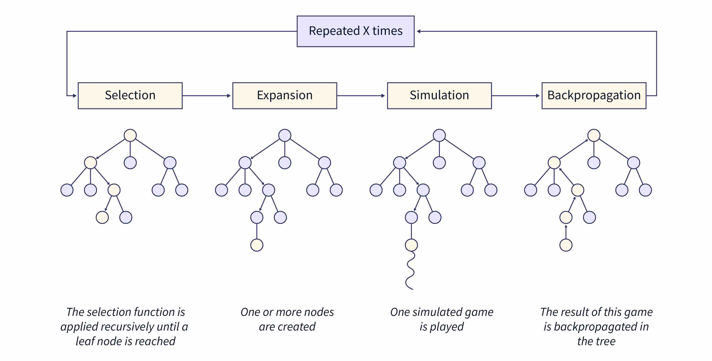

# Notakto - Monte Carlo Tree Search

[notakto.khaledhamam.com](https://notakto.khaledhamam.com) - Deployed on Fly.io

Notakto is a game where two players take turns placing X's on a board. The first player to get three in a row loses.

This implementation utilizes the [Monte Carlo Tree Search (MCTS)](https://en.wikipedia.org/wiki/Monte_Carlo_tree_search) algorithm. Initially, the computer selects random moves, gradually accumulating data on game outcomes. As it does so, it employs the [Upper Confidence Bound for Trees (UCT)](https://www.chessprogramming.org/UCT) principle, striking a balance between exploring new possibilities and exploiting known strategies. Over time, this iterative process refines the computer's gameplay strategy, making it increasingly informed and strategic in its decisions.

Note: The iterations are set to 1000

This implementation is using Elixir and Phoenix LiveView. Why? Because I wanted to try it out 🤷🏻‍♂️.

I used this [repository](https://github.com/rjdellecese/connect_four_umbrella) as a reference for the implementation of the MCTS and copied the Zipper datastructre from it, I highly recommend checking it out.

## Running Locally

To start the Phoenix server:

  * Run `mix setup` to install and setup dependencies
  * Start Phoenix endpoint with `mix phx.server` or inside IEx with `iex -S mix phx.server`
